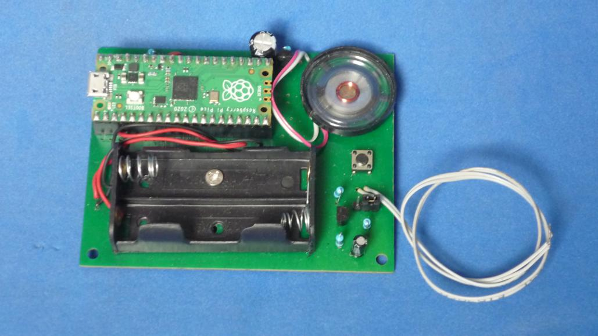

# REPRODUCTOR DE SONIDO BASADO EN RPI PICO

Reproductor de sonido basado en Rpi Pico. Almacena los datos de sonido en la memoria interna. Requiere muy pocos componentes externos y faciles de ensamblar. Fue diseñado con el objetivo de permanecer en modo espera durante muy largo tiempo alimentado por baterias. Puede usarse en relojes de pared musicales, como voz para alguna muñeca o juguete, etc.

Tarjeta de circuito impreso con todos los componentes montados.

Lea esto en otros idiomas: [English](../README.md)

## Funcionamiento general

El circuito ([ver esquematico](../docs/schematic.pdf)) se ha diseñado para que permanezca la mayoria del tiempo en silencio y alimentado por baterias AA, como es el caso de los relojes musicales o jueguetes que hablan. En el mejor de los casos, el Rpi Pico en su menor consumo usando las funciones de sueño profundo, drenara aproximadamente 1.3 mA de las baterias. Un par de baterias AA tiene una capacidad aproximada de 2000 mAh, por lo solamente en modo espera tendrian una duracion aproximada de dos meses. Inaceptable!.

Se diseño un circuito externo que mantiene totalmente apagado el Rpi Pico usando el pin 3V3_EN de esta forma solo consumira aproximadamente unos 70 uA, lo que se traduce en unos 3 años en modo espera. Mucho mejor!

El sistema funciona de la siguiente manera: En modo reposo, un condensador mediante una resistencia grande mantienen el voltaje de conduccion de un mosfet que que es el encargado de mantener activa la señal de apagar el Rpi Pico 3V3_EN . Para reproducir un sonido se debera pulsar brevemente un interruptor. Este interruptor descarga el condensador rapidamente, apagando el mosfet y haciendo que el Rpi Pico se encienda. Una vez encendido el Rpi Pico, este mantiene descargado el condensador mediante un GPIO durante la duracion del sonido. Al finalizar la ejecucion, el GPIO se pone en alta impedancia haciendo que el circuito externo cargue de nuevo el condensador y apague el Rpi Pico hasta la proxima pulsacion!

El Rpi Pico tiene varios sonidos almacenados, y se reproducen en secuencia con cada pulsacion del interruptor. Para poder guardar cual sonido se repoducira en la siguiente pulsacion, se hace uso de la memoria flash interna, por lo que se debera analizar con cuidado la aplicacion final del circuito para evitar desgastes rapidos en la flash.

## Estructura de directorios

El directorio hardware contiene el esquematico y circuito impreso.
* El directorio /hardware/ contiene el proyecto completo en KiCad V5.1.
* El directorio /hardware/gerber contiene los archivos de fabricacion del circuito impreso.
* El directorio /hardware/modules contiene footprints adicionales necesarios para poder editar el circuito impreso.
* El directorio /hardware/library contiene simbolos adicionales necesarios para poder editar el esquematico.

El directorio software contiene el codigo fuente del programa.
* El directorio /software/ contiene el codigo fuente en C desarrollado en el Raspberry Pi Pico SDK.
* El directorio /software/utils contiene scripts suplementarios en python.
* El directorio /software/uf2_binaries contiene archivos compilados listos para descargar al Rpi Pico.
* El directorio /software/sounds contiene archivos de sonido en forma de arrays[] de C.
* El directorio /software/build contendra los archivos cuando se compila el codigo.

El directorio docs contiene archivos adicionales

## Como usar este repositorio

Descripcion breve de como instalar el Rpi Pico SDK. para mayor informacion ir a la guia oficial
(~~~)
sudo apt install cmake gcc-arm-none-eabi libnewlib-arm-none-eabi build-essential
git clone -b master https://github.com/raspberrypi/pico-sdk.git
(~~~)

## Enloquecio el puerto USB!
Si por alguna razon experimentando con el codigo se comete algun error, el puerto usb no responde o envia secuencias de teclas de forma muy rapida, se puede "formatear" la memoria haciendo lo siguiente: Desconecte el Rpi Pico, presione bootsel y mantenga presionado, conecte al computador y deje de presionar bootsel. Copi el archivo flash_nuke.uf2 que se encuentra en la carpeta util al directorio raiz de la unidad de memoria USB. Ahora el Rpi Pico esta como nuevo.

## Licencia
Este es un proyecto de Software Libre y esta licenciado bajo una licencia [MIT License](https://spdx.org/licenses/MIT.html)
