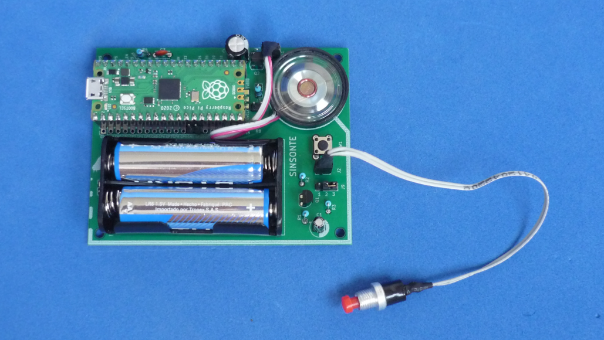

# REPRODUCTOR DE SONIDO BASADO EN RPI PICO

Reproductor de sonido basado en Raspberry Rpi Pico. Almacena los datos de sonido en la memoria interna. Requiere muy pocos componentes externos faciles de conseguir y de ensamblar. Fue diseñado con el objetivo de permanecer en modo espera durante muy largo tiempo alimentado por baterias. Puede usarse en relojes de pared musicales, como voz para alguna muñeca o juguete, etc.

Tarjeta de circuito impreso con todos los componentes montados.

Tambien puede leer esto otros idiomas: [English](../README.md)

## Funcionamiento general

El circuito ([ver esquematico](../docs/schematic.pdf)) se ha diseñado para que permanezca la mayoria del tiempo en silencio y alimentado por 2 baterias AA, como es el caso de los relojes musicales o juguetes que hablan. En el mejor de los casos, el Rpi Pico en su menor consumo (usando funciones de sueño profundo), drenara aproximadamente 1.3 mAh de las baterias. Como un par de baterias AA tiene una capacidad aproximada de 2000 mAh, solamente en modo espera tendrian una duracion aproximada de dos meses. Inaceptable!.

Se adiciono un circuito externo que mantiene totalmente apagado el Rpi Pico usando el pin 3V3_EN de esta forma solo consumira aproximadamente unos 70 uA, lo que se traduce en unos 3 años en modo espera. Mucho mejor!

El sistema funciona de la siguiente manera: En modo reposo, un condensador mediante una resistencia grande mantienen el voltaje de conduccion de un mosfet que es el encargado de poner a tierra la señal 3V3_EN, apagando totalmente la tarjeta. Para reproducir un sonido se debera pulsar brevemente un interruptor. Este interruptor descarga el condensador rapidamente, apagando el mosfet y haciendo que la señal 3V3_EN quede a V+ mediante su resistencia interna, haciendo que el Rpi Pico se encienda. Una vez encendido el Rpi Pico, este mantiene descargado el condensador mediante un GPIO durante la reproduccion del sonido. Al finalizar la reproduccion, el GPIO se pone en alta impedancia haciendo que el circuito externo cargue de nuevo el condensador y apague el Rpi Pico hasta la proxima pulsacion!

En el Rpi Pico se almacenan varios sonidos, y estos se reproducen en secuencia con cada pulsacion del interruptor. Para poder guardar cual sonido se repoducira en la siguiente pulsacion, se hace uso de la memoria flash interna, por lo que se debera analizar con cuidado la aplicacion final del circuito para evitar desgastes rapidos de la flash.

El programa fue escrito usando el Rpi Pico SDK y se porto mas o menos la misma funcionalidad a CircuitPython tambien!

## Estructura de directorios

El directorio hardware contiene el esquematico y circuito impreso.
* El directorio /hardware/ contiene el proyecto completo en KiCad V5.1.
* El directorio /hardware/gerber contiene los archivos de fabricacion del circuito impreso.
* El directorio /hardware/modules contiene footprints adicionales necesarios para poder editar el circuito impreso.
* El directorio /hardware/library contiene simbolos adicionales necesarios para poder editar el esquematico.

El directorio software contiene el codigo fuente del programa.
* El directorio /software/sdk contiene el codigo fuente en C desarrollado en el **Raspberry Pi Pico SDK**.
* El directorio /software/sdk/utils contiene scripts complementarios en python.
* El directorio /software/sdk/uf2_binaries contiene archivos compilados listos para descargar al Rpi Pico.
* El directorio /software/sdk/sounds contiene archivos de sonido en forma de arrays[] de C.
* El directorio /software/sdk/build contendra los archivos cuando se compila el codigo.
* El directorio /software/cp contiene el codigo fuente en Python desarrollado en el **CircuitPython**.
* El directorio /software/cp/sounds contiene archivos de sonido en formato mp3.
* El directorio /software/cp/utils contiene archivos binarios.

El directorio docs contiene archivos adicionales

# C/C++ SDK
## Como usar este repositorio

Esta es una descripcion breve de como instalar el Rpi Pico SDK en Linux (Ubuntu!). Para mayor informacion ir al [repo oficial](https://github.com/raspberrypi/pico-sdk)
~~~
sudo apt install cmake gcc-arm-none-eabi libnewlib-arm-none-eabi build-essential
git clone -b master https://github.com/raspberrypi/pico-sdk.git
cd pico-sdk
git submodule update --init
~~~
Se debera añadir la siguiente linea al archivo .bashrc y despues de hacerlo, reiniciar sesion para que tome efecto
~~~
export PICO_SDK_PATH={ruta sdk}/pico-sdk
~~~
Clonar el repositorio del proyecto
~~~
git clone https://github.com/galopago/SINSONTE.git
~~~
* Modificar el archivo /SINSONTE/software/CMakeLists.txt cambiando las rutas del SDK Pico por la ruta en que se instalo en su propia computadora.
* Borrar el archivo /SINSONTE/software/build/CMakeCache.txt
* Borrar el archivo /SINSONTE/software/build/elf2uf2/CMakeCache.txt

Mediante la interfaz linea de comando acceda al directorio /SINSONTE/software/build
~~~
cd software/build
~~~
Crear los makefiles
~~~
cmake ..
~~~
Y finalmente para compilar:
~~~
make clean
make all
~~~
El programa compilado (.uf2) para descargar al Rpi Pico se encontrara en la carpeta /SINSONTE/software/build

## Como cambiar los archivos de sonido

El programa presentado aqui reproduce 12 diferentes archivos de sonido de forma secuencial. Si se quiere cambiar uno o todos los archivos se debera tener en cuenta lo siguiente:

* La duracion maxima de almacenamiento de la memoria es de 24 segundos (2 segundos por sonido * 12 = 24 segundos)
* Los archivos deberan convertirse a formato .WAV monofonico de 16 bits y a 44100 hz antes de ser procesados por la aplicacion que los convertira en array[] de C.

Una vez se tienen los archivos con las caracteristicas anteriormente mencionadas, se usara la aplicacion **wav2c.py** que se encuentra en la ruta /SINSONTE/software/utils/

Esta aplicacion recibe dos parameteros: el nombre de arhcivo de entrada (.wav) y nombre de archivo de salida (.h). Los nombres de los archivos convertidos deberan llamarse 1.h a 12.h. Un ejemplo seria el siguiente:

~~~
python3 wav2c.py ejemplo.wav 5.h
~~~

El archivo generado (5.h) debera ponerse en la carpeta /SINSONTE/software/ y recompilar el codigo

# CircuitPython
## Como usar este repositorio

Clonar el repositorio del proyecto
~~~
git clone https://github.com/galopago/SINSONTE.git
~~~
* Poner el Rpi Pico en modo programacion y luego conectar a un PC
* Para iniciar con todo limpio, descargar al Rpi Pico el archivo **flash_nuke.uf2** que se encuentra en /SINSONTE/software/cp/utils
* Poner nuevamente el Rpi Pico en modo programacion y conectar a un PC
* Instalar CircuitPython descargandole el archivo **adafruit-circuitpython-raspberry_pi_pico-en_US-6.3.0.uf2** que se encuentra en /SINSONTE/software/cp/utils
* Una vez ya se ha instalado CircuitPython, descargar al Rpi Pico el archivo **code.py** y los archivos de sonido (1.mp3 al 12.mp3) que se encuentran en /SINSONTE/software/cp/ 

## Como cambiar los archivos de sonido
Descargar al Pico sus propios archivos .mp3, estos deben llamarse 1.mp3 al 12.mp3

## Licencia
Este es un proyecto de Software Libre y esta licenciado bajo una licencia [MIT License](https://spdx.org/licenses/MIT.html)
